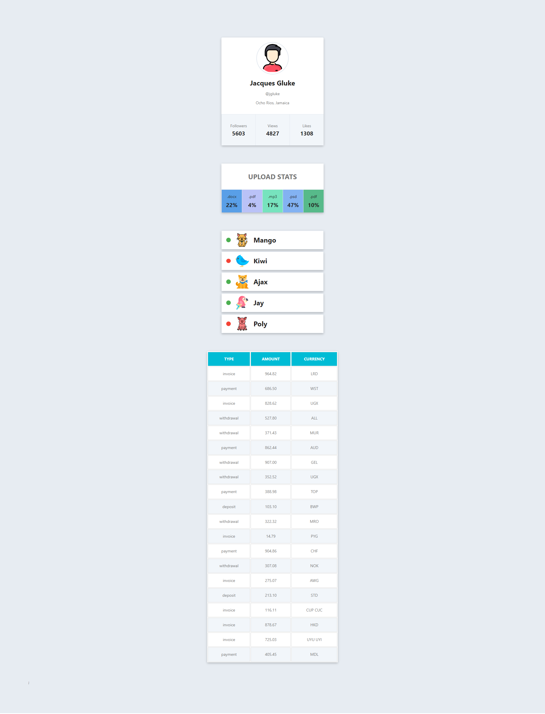

# Профіль соціальної мережі

Необхідно створити компонент `<Profile>`, за допомогою якого ми могли б
відображати інформацію про користувача соціальної мережі. Дані про користувача
лежать у файлі user.json.

## Опис компонента `<Profile>`

Компонент повинен приймати кілька пропсів з інформацією про користувача:

- `username` — ім'я користувача
- `tag` — тег в соціальній мережі без `@`
- `location` — місто і країна
- `avatar` — посилання на зображення
- `stats` — об'єкт з інформацією про активності

# Секція статистики

Створити компонент `<Statistics>`, який би відображав статистику з переданих
пропсів. Наприклад, завантаження у хмару за типом файлів, відвідування
веб-сторінки користувачами різних країн, фінансові витрати тощо. Дані про
статистику лежать у файлі data.json.

## Опис компонента

Компонент повинен приймати два пропи `title` і `stats`, в яких вказується
заголовок та об'єкт статистики.

- `title` – не обов'язковий, і якщо він не переданий, не повинна рендеритись
  розмітка заголовка `<h2>`.
- `stats` – масив об'єктів, що містять інформацію про елемент статистики. Може
  мати довільну кількість елементів.
- Колір фону елемента статистики в оформленні можна пропустити або створити
  функцію для генерації випадкового кольору.

# Список друзів

Необхідно створити компонент `<FriendList>`, за допомогою якого ми могли б
відображати інформацію про друзів користувача. Інформація про друзів
зберігається у файлі friends.json.

## Опис компонента `<FriendList>`

Компонент повинен приймати один проп `friends` – масив об'єктів друзів.

## Опис компонента `<FriendListItem>`

Компонент повинен приймати кілька пропів:

- `avatar` – посилання на аватар
- `name` – ім'я друга
- `isOnline` – буль, що сигналізує про стан друга: в мережі або ні.

Залежно від пропа `isOnline`, повинен змінюватися колір фону `span.status`. Це
можна зробити за допомогою різних CSS-класів або Styled Components.

# Історія транзакцій

Необхідно створити компонент історії транзакцій в особистому кабінеті
інтернет-банку.

Дані для списку доступні у форматі JSON у файлі transactions.json. Це масив
об'єктів, кожен об'єкт описує одну транзакцію з наступними властивостями:

- `id` — унікальний ідентифікатор транзакції
- `type` — тип транзакції
- `amount` - сума транзакції
- `currency` - тип валюти

## Опис компонента `<TransactionHistory>`

Необхідно створити компонент `<TransactionHistory>`, який приймає один проп
`items` – масив об'єктів транзакцій з `transactions.json`. Компонент створює
розмітку таблиці. Кожна транзакція – це рядок таблиці.

### Фінальний результат

